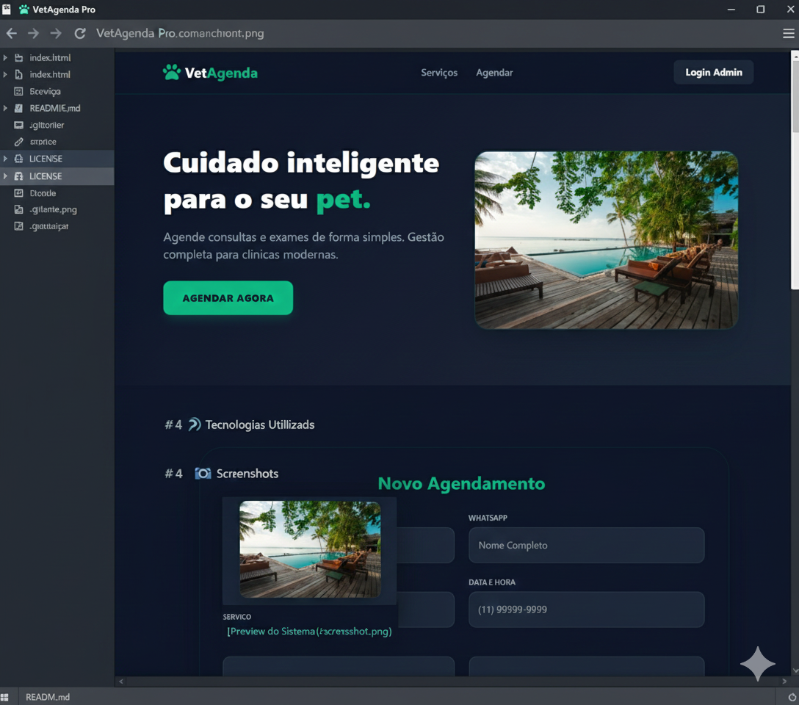

# 🐾 VetAgenda Pro

> Sistema Full-Stack de gestão e agendamento veterinário em tempo real.

## 🚀 Tecnologias Utilizadas

- **Front-end:** HTML5, Tailwind CSS, JavaScript (ES6+)
- **Back-end as a Service:** [Supabase](https://supabase.com/)
- **Banco de Dados:** PostgreSQL (Relational)
- **Hospedagem:** GitHub Pages

## 🛠️ Funcionalidades

- [x] Agendamento online com validação.
- [x] Dashboard administrativo protegido por senha.
- [x] Persistência de dados em nuvem.
- [x] Integração direta com WhatsApp para notificações.
- [x] Interface 100% responsiva (Mobile First).

## 🛡️ Segurança (RLS)

O projeto utiliza **Row Level Security** no PostgreSQL, garantindo que o acesso público seja restrito apenas à inserção de dados, protegendo a integridade do banco de dados.

## 👤 Autor

Desenvolvido por **EngSivaldo**.

